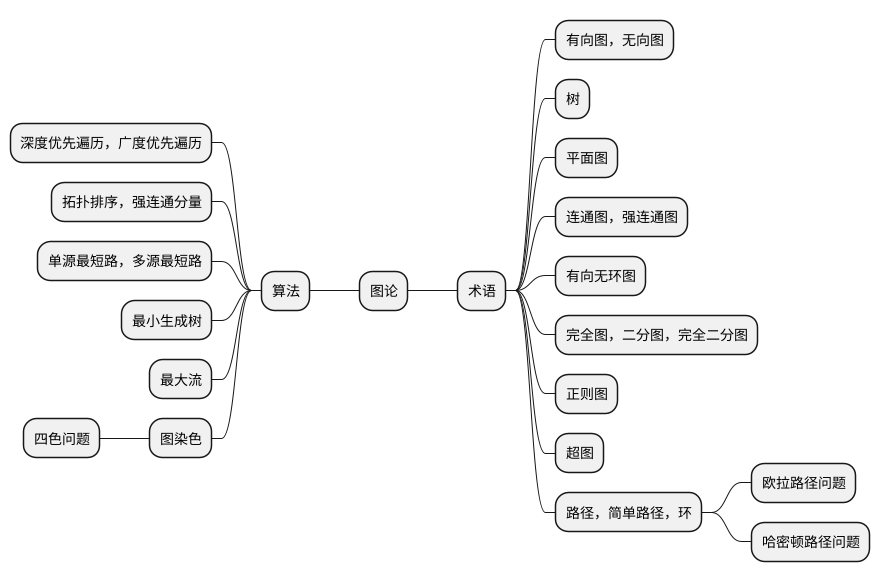

# 数学概念

## 图论知识点

```puml
@startmindmap
+ 图论
++ 术语
+++ 有向图，无向图
+++ 树
+++ 平面图
+++ 连通图，强连通图
+++ 有向无环图
+++ 完全图，二分图，完全二分图
+++ 正则图
+++ 超图
+++ 路径，简单路径，环
++++ 欧拉路径问题
++++ 哈密顿路径问题
-- 算法
--- 深度优先遍历，广度优先遍历
--- 拓扑排序，强连通分量
--- 单源最短路，多源最短路
--- 最小生成树
--- 最大流
--- 图染色
---- 四色问题
@endmindmap
```
